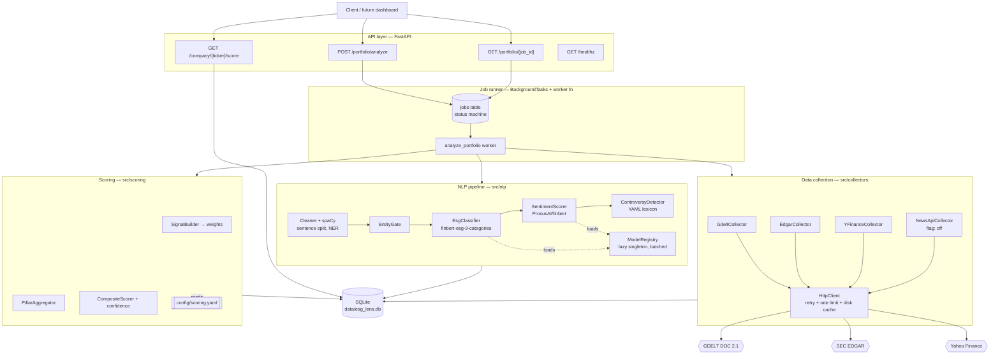

# Architecture — ESG Lens

## 1. Design constraints
1. **Free-tier only** — no paid APIs, no GPU assumed, no managed cloud services.
2. **Single-process by default** — must run with `uvicorn src.esg_lens.api.main:app` and nothing else.
3. **Transparent** — every score traceable to stored documents; no black box.
4. **Slow NLP** — ~10 s/company on CPU ⇒ analysis **must** be an async job, never a sync request.
5. **Rude external APIs** — everything network-facing is behind an interface, cached, and retried.

---

## 2. Component diagram



## 3. Data flow (one job)

```
POST /portfolio/analyze {tickers:[AAPL,XOM]}
   │
   ├─ validate tickers ──────────────► 422 on bad input
   ├─ INSERT job (status=queued) ────► 202 {job_id}
   └─ BackgroundTasks.add_task(run_job)
            │
      ┌─────┴──── per ticker ───────────────────────────────┐
      │ 1. resolve   ticker → CIK + metadata (cache 7d)     │
      │ 2. collect   GDELT news, EDGAR filings (cache 24h)  │
      │              → INSERT raw_documents (dedup on hash) │
      │ 3. nlp       only docs with no signal row yet       │
      │              → INSERT esg_signals                    │
      │ 4. score     read signals + config                   │
      │              → INSERT esg_scores (append-only)       │
      │ 5. job_items.status = done | failed(reason)          │
      └──────────────────────────────────────────────────────┘
            │
            └─ job.status = done | partial | failed
```

**Idempotency:** steps 2–4 are re-entrant. `raw_documents` dedups on `content_hash`;
NLP only processes documents lacking a signal row for the current `model_version`;
scores are append-only, so re-running produces a new row and history is preserved.

---

## 4. Directory structure

```
esg-lens/
├── README.md
├── requirements.txt
├── pyproject.toml
├── .env.example
├── config/
│   ├── scoring.yaml              # pillar/category weights, thresholds  (versioned!)
│   ├── controversy_lexicon.yaml  # severity tiers
│   └── sources.yaml              # domain → credibility tier
├── data/
│   ├── esg_lens.db               # SQLite (gitignored)
│   ├── cache/                    # HTTP response cache (gitignored)
│   └── models/                   # HF cache (gitignored)
├── docs/                         # ← these planning documents
├── src/esg_lens/
│   ├── __init__.py
│   ├── config.py                 # pydantic-settings; loads .env + config/*.yaml
│   ├── models.py                 # pydantic domain models (Document, Signal, Score…)
│   ├── db/
│   │   ├── schema.sql            # DDL from docs/data_model.md
│   │   ├── engine.py             # connection factory, WAL pragma, migrations
│   │   └── repositories.py       # CompanyRepo, DocumentRepo, SignalRepo, ScoreRepo, JobRepo
│   ├── collectors/
│   │   ├── base.py               # Collector ABC: fetch(ticker, since) -> list[RawDocument]
│   │   ├── http.py               # shared httpx client: UA, rate limit, retry, disk cache
│   │   ├── gdelt.py
│   │   ├── edgar.py              # incl. ticker→CIK map + 10-K item sectioning
│   │   ├── yfinance_meta.py
│   │   └── newsapi.py            # feature-flagged off
│   ├── nlp/
│   │   ├── registry.py           # lazy-loaded, process-wide model singletons
│   │   ├── clean.py              # boilerplate strip, dedup, sentence split
│   │   ├── entity.py             # EntityGate (spaCy NER + alias table)
│   │   ├── classify.py           # EsgClassifier
│   │   ├── sentiment.py          # SentimentScorer
│   │   ├── controversy.py        # lexicon matcher + negation guard
│   │   └── pipeline.py           # orchestrates doc → Signal
│   ├── scoring/
│   │   ├── weights.py            # w_src, w_rec, w_cat, w_conf
│   │   ├── aggregate.py          # pillar sub-scores + penalties
│   │   └── composite.py          # composite, confidence, sector percentile
│   ├── jobs/
│   │   ├── runner.py             # run_job orchestration + state machine
│   │   └── store.py              # job persistence
│   └── api/
│       ├── main.py               # FastAPI app, lifespan (warm models, migrate db)
│       ├── deps.py
│       ├── schemas.py            # request/response pydantic models
│       └── routes/{portfolio,company,health}.py
├── scripts/
│   ├── init_db.py
│   ├── warm_models.py            # pre-download HF weights
│   ├── backfill.py               # CLI: analyze tickers without the API
│   └── sensitivity.py            # weight perturbation analysis
└── tests/
    ├── conftest.py               # in-memory sqlite + fake collectors + stub models
    ├── fixtures/                 # recorded GDELT/EDGAR JSON, sample filings
    ├── unit/{test_weights,test_aggregate,test_controversy,test_entity}.py
    ├── integration/{test_collectors,test_pipeline,test_repositories}.py
    └── api/test_endpoints.py
```

---

## 5. Component responsibilities

### 5.1 Collectors (`src/esg_lens/collectors`)
Each implements `Collector.fetch(ticker, since) -> list[RawDocument]`. Rules:
- **No parsing logic in the caller.** Collectors return normalised `RawDocument` objects.
- All HTTP goes through `http.py`: mandatory `User-Agent` (EDGAR requires a contact email),
  per-host token-bucket rate limiting (EDGAR 10/s, GDELT 1/s), `tenacity` retry with
  exponential backoff on 429/5xx, and a disk cache keyed on the request URL.
- **Never raise out of a collector.** Return `[]` and log; one dead source must not fail a job.

### 5.2 NLP (`src/esg_lens/nlp`)
- `registry.py` holds process-wide singletons. Models load **once** at app startup
  (FastAPI `lifespan`), never per request. Loading FinBERT per document is the classic
  performance-killing mistake here.
- **Batch inference.** Pass lists to the HF pipeline (`batch_size=16`), not one string at a time.
- Set `torch.set_num_threads()` from config and pin `device=-1` (CPU) unless CUDA is present.
- Every signal row records `model_version` so re-running with a new model is detectable.

### 5.3 Scoring (`src/esg_lens/scoring`)
- **Pure functions.** No I/O, no DB, no network. Input: `list[Signal]` + config. Output: score.
  This is what makes the methodology unit-testable and the results reproducible.
- Reads `config/scoring.yaml`; the file's `version` field is stamped on every score row.

### 5.4 Jobs (`src/esg_lens/jobs`)
- v1 uses FastAPI `BackgroundTasks` — no Redis, no Celery. Job state lives in SQLite, so a
  restart leaves jobs visibly `running` with a stale heartbeat; a startup sweep marks
  jobs stale for >1h as `failed`.
- **Concurrency:** one job at a time via a module-level `asyncio.Semaphore(1)` around NLP.
  Transformers on CPU do not benefit from parallel jobs and will thrash memory.
- Interface is deliberately narrow (`enqueue`, `get`, `update`) so swapping in Celery/RQ
  later touches one file.

### 5.5 API (`src/esg_lens/api`)
Thin. Validate → call repo/job store → serialise. **No business logic in route handlers.**

---

## 6. Technology choices

| Choice | Why | Rejected alternative |
|---|---|---|
| **SQLite** | Zero-config, single file, ships with Python, plenty for 10k docs. WAL mode handles one writer + many readers. | Postgres — real ops burden for a portfolio project. Keep SQL ANSI-ish so migration is possible. |
| **Raw SQL + repositories** | Schema is small and stable; the DDL doubles as documentation. Avoids ORM-lazy-loading surprises. | SQLAlchemy ORM — worth it if the schema grows past ~10 tables. |
| **FastAPI** | Async, pydantic validation for free, OpenAPI docs out of the box — the dashboard gets a typed client for nothing. | Flask — no async, no schema generation. |
| **pydantic v2** | One model definition serves validation, serialisation, and API docs. | dataclasses + manual validation. |
| **HF transformers pipelines** | Fastest path to FinBERT; handles tokenisation and batching. | ONNX Runtime — 2–4× faster on CPU; a documented Phase-3 optimisation, not v1. |
| **pandas** | Aggregation, sector percentiles, the sensitivity script. | Pure Python — fine too; pandas is worth its weight for the analysis scripts. |
| **BackgroundTasks** | Zero infrastructure. | Celery+Redis — a second process and a broker for a single-user tool. |
| **httpx + tenacity** | Async-capable client, clean retry decorators. | requests — sync-only. |
| **YAML config** | Non-programmers can tune weights; diffs are readable in PRs. | Hard-coded constants — fatal for a "transparent methodology" claim. |

---

## 7. Cross-cutting concerns
- **Config:** `pydantic-settings`, `.env` for secrets, `config/*.yaml` for methodology.
  Never put weights in `.env` and never put API keys in YAML.
- **Logging:** `structlog` JSON to stdout, with `job_id` and `ticker` bound to the context.
- **Errors:** typed exception hierarchy (`CollectorError`, `NlpError`, `ScoringError`);
  API maps them to RFC-7807-shaped problem responses.
- **Caching layers:** (1) HTTP disk cache 24 h; (2) `raw_documents` content-hash dedup;
  (3) signals keyed by `(document_id, model_version)`; (4) scores append-only with
  `computed_at`, and `GET /company/{ticker}/score` serves the latest without recomputation.
- **Testing:** collectors tested against recorded fixtures (no live network in CI); NLP tested
  with stub models asserting *pipeline wiring*, not model accuracy; scoring tested exhaustively
  with hand-computed expected values — including the worked example in the methodology doc.
- **Security:** ticker input validated against `^[A-Z0-9.\-]{1,10}$`; strict portfolio size cap
  (default 25) so nobody can queue a 5,000-ticker job; no secrets in logs; SQL exclusively
  parameterised.

---

## 8. Deliberate non-goals for v1
Frontend/dashboard · authentication · multi-user · real-time streaming · full article-body
scraping · non-US issuers · non-English text · model fine-tuning · Docker/K8s deployment.
