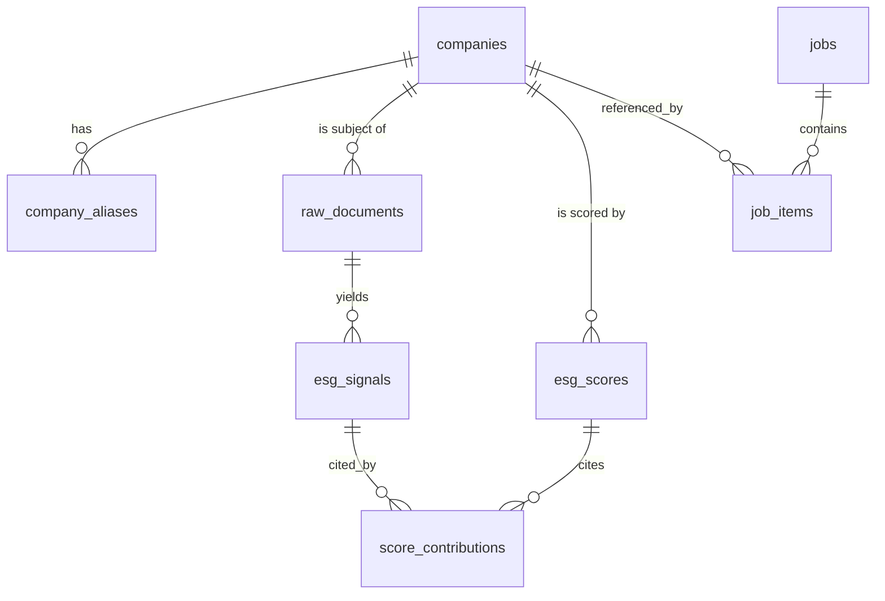

# Data Model — ESG Lens

SQLite (WAL). DDL below is the authoritative source for `src/esg_lens/db/schema.sql`.
Timestamps are ISO-8601 UTC strings (`TEXT`) — SQLite has no native datetime, and text
sorts correctly. Booleans are `INTEGER` 0/1.

## Entity relationships



---

## DDL

```sql
PRAGMA journal_mode = WAL;
PRAGMA foreign_keys = ON;

-- =====================================================================
-- 1. COMPANY METADATA
-- =====================================================================
CREATE TABLE IF NOT EXISTS companies (
    ticker           TEXT PRIMARY KEY,                 -- 'AAPL', uppercase
    cik              TEXT,                             -- SEC CIK, 10-digit zero-padded
    name             TEXT NOT NULL,
    sector           TEXT,                             -- drives pillar weights
    industry         TEXT,
    country          TEXT,
    exchange         TEXT,
    market_cap       INTEGER,                          -- USD; used for coverage-bias notes
    currency         TEXT,
    -- Benchmark only. NEVER an input to our own score. See research_notes.md §2.1.
    external_esg_score      REAL,
    external_esg_provider   TEXT,
    metadata_json    TEXT,                             -- raw provider payload, for debugging
    fetched_at       TEXT NOT NULL,
    updated_at       TEXT NOT NULL DEFAULT (datetime('now'))
);
CREATE INDEX IF NOT EXISTS idx_companies_sector ON companies(sector);
CREATE INDEX IF NOT EXISTS idx_companies_cik    ON companies(cik);

-- Alias table powers the entity gate (spaCy NER match + query expansion).
CREATE TABLE IF NOT EXISTS company_aliases (
    id        INTEGER PRIMARY KEY AUTOINCREMENT,
    ticker    TEXT NOT NULL REFERENCES companies(ticker) ON DELETE CASCADE,
    alias     TEXT NOT NULL,                           -- 'Exxon Mobil', 'ExxonMobil', 'Exxon'
    alias_type TEXT NOT NULL CHECK (alias_type IN ('legal','common','brand','former','domain')),
    UNIQUE (ticker, alias)
);
CREATE INDEX IF NOT EXISTS idx_aliases_alias ON company_aliases(alias);

-- =====================================================================
-- 2. RAW DOCUMENTS  (news headlines + filing sections)
-- =====================================================================
CREATE TABLE IF NOT EXISTS raw_documents (
    id             INTEGER PRIMARY KEY AUTOINCREMENT,
    ticker         TEXT NOT NULL REFERENCES companies(ticker) ON DELETE CASCADE,
    source         TEXT NOT NULL CHECK (source IN ('gdelt','edgar','yfinance','newsapi','rss')),
    doc_type       TEXT NOT NULL CHECK (doc_type IN ('news','filing_section','press_release')),
    external_id    TEXT,                               -- GDELT doc id / EDGAR accession no.
    url            TEXT,
    domain         TEXT,                               -- normalised host → source credibility tier
    title          TEXT,
    body           TEXT,                               -- headline text, or filing item text
    language       TEXT DEFAULT 'en',
    published_at   TEXT,                               -- UTC; drives recency decay
    -- Filing-specific
    filing_type    TEXT,                               -- '10-K','8-K','DEF 14A'
    filing_section TEXT,                               -- 'Item 1A','Item 1','Risk Factors'
    -- Dedup: sha256(lower(normalized_title) || '|' || coalesce(external_id,url,''))
    content_hash   TEXT NOT NULL,
    collected_at   TEXT NOT NULL DEFAULT (datetime('now')),
    raw_json       TEXT,
    UNIQUE (ticker, content_hash)
);
CREATE INDEX IF NOT EXISTS idx_docs_ticker_pub ON raw_documents(ticker, published_at DESC);
CREATE INDEX IF NOT EXISTS idx_docs_source     ON raw_documents(source);
CREATE INDEX IF NOT EXISTS idx_docs_hash       ON raw_documents(content_hash);

-- =====================================================================
-- 3. PROCESSED SIGNALS  (one row per document per model version)
-- =====================================================================
CREATE TABLE IF NOT EXISTS esg_signals (
    id              INTEGER PRIMARY KEY AUTOINCREMENT,
    document_id     INTEGER NOT NULL REFERENCES raw_documents(id) ON DELETE CASCADE,
    ticker          TEXT NOT NULL REFERENCES companies(ticker) ON DELETE CASCADE,

    -- Gate outcomes; excluded docs are KEPT with a reason (auditability).
    included        INTEGER NOT NULL DEFAULT 1,
    exclusion_reason TEXT CHECK (exclusion_reason IN
                       (NULL,'entity_mismatch','not_esg_relevant','too_old',
                        'low_confidence','duplicate','unsupported_language')),

    -- Classification
    pillar          TEXT CHECK (pillar IN (NULL,'E','S','G')),
    category        TEXT,                              -- one of the 9 FinBERT-ESG categories
    relevance       REAL,                              -- rel(d) ∈ [0,1]

    -- Polarity
    sentiment_score REAL,                              -- P(pos)-P(neg) ∈ [-1,1]
    sentiment_label TEXT CHECK (sentiment_label IN (NULL,'positive','negative','neutral')),
    controversy_severity INTEGER NOT NULL DEFAULT 0
                        CHECK (controversy_severity BETWEEN 0 AND 3),
    controversy_terms TEXT,                            -- JSON array of matched terms — the audit trail
    polarity        REAL,                              -- pol(d) ∈ [-1,1], post-combination

    -- Weights (persisted so a score can be re-derived without re-running NLP)
    weight_source   REAL,
    weight_recency  REAL,
    weight_category REAL,
    weight_total    REAL,

    entities_json   TEXT,                              -- spaCy ORG entities found
    model_version   TEXT NOT NULL,                     -- 'finbert-esg-9cat@v1|prosus-finbert@v1|lex@2026-09'
    processed_at    TEXT NOT NULL DEFAULT (datetime('now')),
    UNIQUE (document_id, model_version)
);
CREATE INDEX IF NOT EXISTS idx_signals_ticker_pillar ON esg_signals(ticker, pillar, included);
CREATE INDEX IF NOT EXISTS idx_signals_document      ON esg_signals(document_id);
CREATE INDEX IF NOT EXISTS idx_signals_controversy   ON esg_signals(ticker, controversy_severity)
    WHERE controversy_severity > 0;

-- =====================================================================
-- 4. COMPUTED SCORES  (append-only — history is a feature)
-- =====================================================================
CREATE TABLE IF NOT EXISTS esg_scores (
    id                  INTEGER PRIMARY KEY AUTOINCREMENT,
    ticker              TEXT NOT NULL REFERENCES companies(ticker) ON DELETE CASCADE,
    composite_score     REAL,                          -- NULL when status='insufficient_data'
    e_score             REAL,
    s_score             REAL,
    g_score             REAL,
    e_penalty           REAL NOT NULL DEFAULT 0,
    s_penalty           REAL NOT NULL DEFAULT 0,
    g_penalty           REAL NOT NULL DEFAULT 0,
    confidence          REAL,                          -- [0,1]
    sector_percentile   REAL,                          -- NULL when <5 scored peers
    status              TEXT NOT NULL DEFAULT 'ok'
                        CHECK (status IN ('ok','insufficient_data','failed')),
    n_documents         INTEGER NOT NULL DEFAULT 0,
    n_signals           INTEGER NOT NULL DEFAULT 0,    -- documents that passed both gates
    evidence_weight     REAL,                          -- Σ w(d)
    window_start        TEXT,
    window_end          TEXT,
    methodology_version TEXT NOT NULL,                 -- config/scoring.yaml `version`
    config_hash         TEXT NOT NULL,                 -- sha256 of the resolved config
    job_id              TEXT REFERENCES jobs(id) ON DELETE SET NULL,
    computed_at         TEXT NOT NULL DEFAULT (datetime('now'))
);
CREATE INDEX IF NOT EXISTS idx_scores_ticker_time ON esg_scores(ticker, computed_at DESC);
CREATE INDEX IF NOT EXISTS idx_scores_job         ON esg_scores(job_id);

-- Latest score per ticker — what GET /company/{ticker}/score reads.
CREATE VIEW IF NOT EXISTS v_latest_scores AS
SELECT s.* FROM esg_scores s
WHERE s.computed_at = (
    SELECT MAX(s2.computed_at) FROM esg_scores s2 WHERE s2.ticker = s.ticker
);

-- Which signals drove which score → the "explain" endpoint.
CREATE TABLE IF NOT EXISTS score_contributions (
    id            INTEGER PRIMARY KEY AUTOINCREMENT,
    score_id      INTEGER NOT NULL REFERENCES esg_scores(id) ON DELETE CASCADE,
    signal_id     INTEGER NOT NULL REFERENCES esg_signals(id) ON DELETE CASCADE,
    pillar        TEXT NOT NULL CHECK (pillar IN ('E','S','G')),
    contribution  REAL NOT NULL,                       -- signed points contributed
    rank          INTEGER,                             -- 1 = largest |contribution|
    UNIQUE (score_id, signal_id)
);
CREATE INDEX IF NOT EXISTS idx_contrib_score ON score_contributions(score_id, rank);

-- =====================================================================
-- 5. JOBS
-- =====================================================================
CREATE TABLE IF NOT EXISTS jobs (
    id            TEXT PRIMARY KEY,                    -- uuid4 string
    status        TEXT NOT NULL DEFAULT 'queued'
                  CHECK (status IN ('queued','running','done','partial','failed','cancelled')),
    tickers_json  TEXT NOT NULL,                       -- requested tickers
    n_total       INTEGER NOT NULL,
    n_completed   INTEGER NOT NULL DEFAULT 0,
    n_failed      INTEGER NOT NULL DEFAULT 0,
    current_stage TEXT,                                -- 'collecting'|'nlp'|'scoring'
    current_ticker TEXT,
    error         TEXT,
    force_refresh INTEGER NOT NULL DEFAULT 0,
    created_at    TEXT NOT NULL DEFAULT (datetime('now')),
    started_at    TEXT,
    finished_at   TEXT,
    heartbeat_at  TEXT                                 -- startup sweep fails stale jobs
);
CREATE INDEX IF NOT EXISTS idx_jobs_status ON jobs(status, created_at DESC);

CREATE TABLE IF NOT EXISTS job_items (
    id          INTEGER PRIMARY KEY AUTOINCREMENT,
    job_id      TEXT NOT NULL REFERENCES jobs(id) ON DELETE CASCADE,
    ticker      TEXT NOT NULL,
    status      TEXT NOT NULL DEFAULT 'pending'
                CHECK (status IN ('pending','running','done','failed','skipped')),
    stage       TEXT,
    error       TEXT,
    score_id    INTEGER REFERENCES esg_scores(id) ON DELETE SET NULL,
    n_documents INTEGER DEFAULT 0,
    started_at  TEXT,
    finished_at TEXT,
    UNIQUE (job_id, ticker)
);
CREATE INDEX IF NOT EXISTS idx_job_items_job ON job_items(job_id);

-- =====================================================================
-- 6. OPERATIONAL
-- =====================================================================
CREATE TABLE IF NOT EXISTS collection_runs (
    id             INTEGER PRIMARY KEY AUTOINCREMENT,
    ticker         TEXT NOT NULL,
    source         TEXT NOT NULL,
    job_id         TEXT REFERENCES jobs(id) ON DELETE SET NULL,
    status         TEXT NOT NULL CHECK (status IN ('ok','partial','failed','cached')),
    n_fetched      INTEGER DEFAULT 0,
    n_new          INTEGER DEFAULT 0,
    window_start   TEXT,
    window_end     TEXT,
    error          TEXT,
    duration_ms    INTEGER,
    ran_at         TEXT NOT NULL DEFAULT (datetime('now'))
);
CREATE INDEX IF NOT EXISTS idx_runs_ticker_source ON collection_runs(ticker, source, ran_at DESC);

CREATE TABLE IF NOT EXISTS schema_migrations (
    version    INTEGER PRIMARY KEY,
    applied_at TEXT NOT NULL DEFAULT (datetime('now'))
);
```

---

## Design notes

**Why keep excluded documents?** `esg_signals.included = 0` with an `exclusion_reason` lets the
API report "142 documents seen, 38 ESG-relevant" and lets you debug an over-aggressive entity
gate without re-collecting. Deleting them destroys the audit trail that is this project's premise.

**Why append-only scores?** Re-running with tuned weights must not overwrite history. The
`methodology_version` + `config_hash` pair makes any score exactly reproducible, and score
history over time is a natural dashboard feature you get for free.

**Why `UNIQUE(document_id, model_version)` on signals?** Upgrading a model re-processes documents
without deleting the old inference, so you can diff model versions on identical inputs.

**Why persist the weights on the signal row?** Re-deriving a score becomes a pure SQL aggregation
with no model inference — which makes the sensitivity script fast and the "explain" endpoint cheap.

**SQLite caveats to respect:** no native `BOOLEAN`/`DATETIME`; `CHECK` constraints allowing `NULL`
must list `NULL` explicitly as shown; enable `PRAGMA foreign_keys = ON` on **every connection**
(it is off by default per-connection); use WAL for concurrent reads during a running job.
